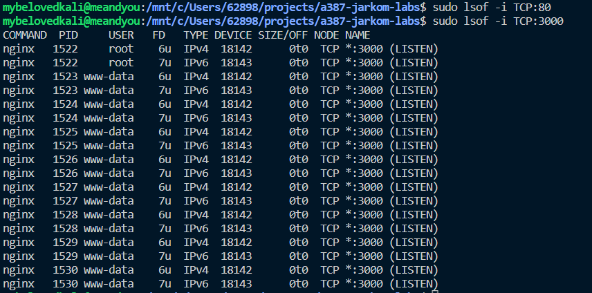
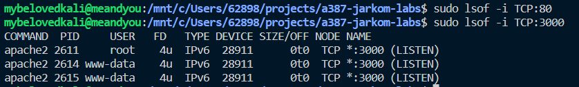

#### Kriteria 1
- [v] clone repo https://github.com/dicodingacademy/a387-jarkom-labs.git
- [v] pasang NGINX
- [v] memastikan web server node.js & nginx sama-sama bisa diakses

#### Kriteria 2
- [v] selesaikan kriteria 1
- [v] konfigurasi nginx menjadi reverse proxy server

#### Kriteria 3
- [v] selesaikan kriteria 2
- [v] konfigurasi nginx untuk menerapkan limit access

#### Saran
- [v] ubah port nginx dari 80 ke 3000 [I](konfigurasiNGINX_RickyAston.txt)

- [v] ubah konfigurasi rate limit menjadi 6r/m [*lihat file konfigurasi nginx*](konfigurasiNGINX_RickyAston.txt)
- [v] ubah repson web server node.js menjadi nama lengkap [*lihat file app.js*](app.js)
- [v] implementasi konfigurasi yang sama pada apache2 [*lihat file konfigurasi apache2*](konfigurasiNGINX_RickyAston.txt) dan [*file ports apache2*](ports_RickyAston.txt)
